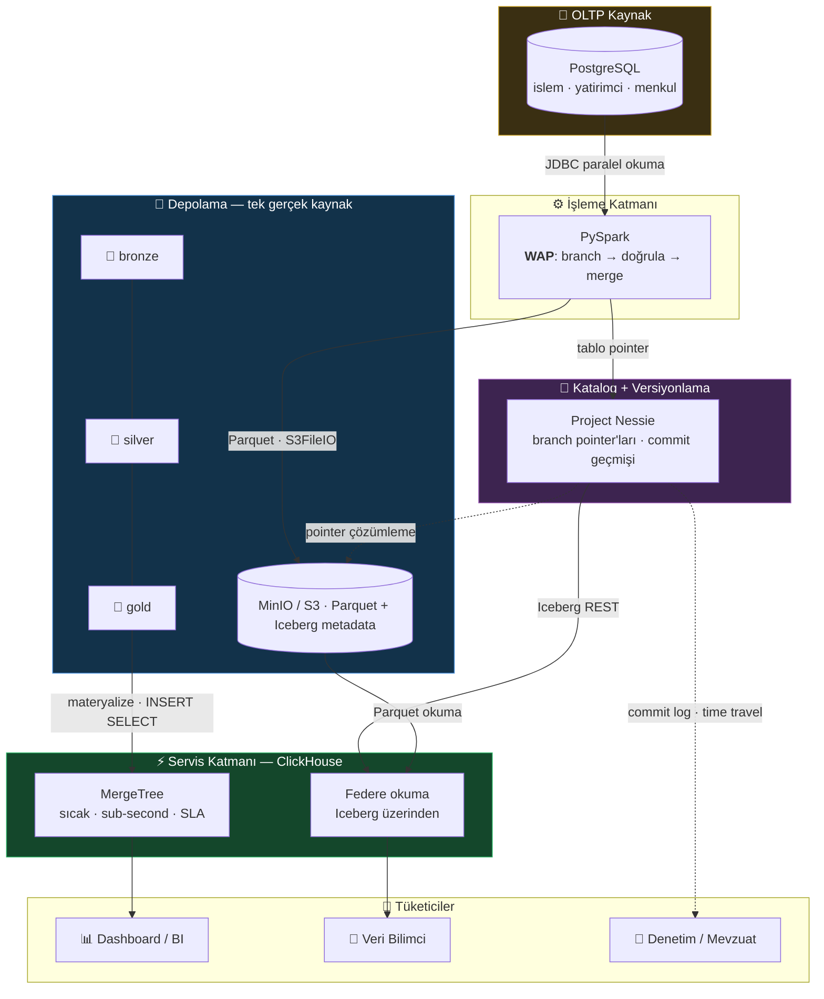
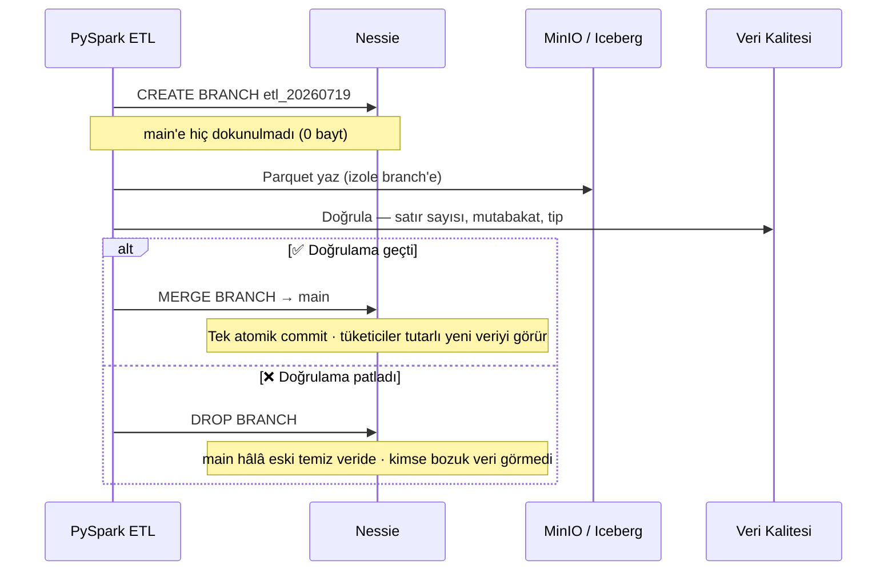
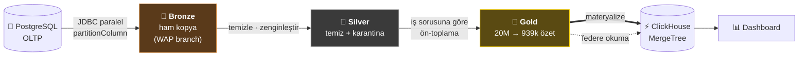
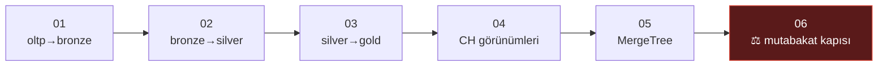

<div align="center">

# 🏛️ CSD Data Lakehouse

### MinIO · Apache Iceberg · Project Nessie · PySpark · ClickHouse · Airflow

**Bir menkul kıymet saklama kuruluşunun (CSD — _Central Securities Depository_) analitik iş yükünü modelleyen; uçtan uca, tamamen lokal çalışan referans Lakehouse mimarisi.**

<br/>


<br/>

> ### `PostgreSQL 15.414 ms` → `Gold 10 ms` &nbsp;=&nbsp; **1.541× hızlanma**
>
> 20.000.000 satırda **ölçüldü**, tahmin edilmedi. Ve makas veri büyüdükçe _açılıyor_.

</div>

---

> [!NOTE]
> **Bu bir öğrenme / referans projesidir.** Bir mühendislik stajı sırasında, kendini
> geliştirme amaçlı geliştirildi. "CSD" jenerik bir sektör terimidir; herhangi bir
> kurumu temsil etmez. **Veri tamamen sentetiktir** (`random()` + `generate_series`
> ile üretilir), şema temsilîdir. Gerçek veri, gerçek şema veya kuruma özel bilgi
> **içermez**. Üretime giderken gereken eksikler bilinçli olarak
> [§ Bilinen sınırlar](#sinirlar) ve [`docs/01-mimari.md` §8](docs/01-mimari.md)
> içinde dürüstçe listelenmiştir.

---

## 📑 İçindekiler

<table>
<tr>
<td>

1. [Neden bu proje? — öne çıkanlar](#one-cikanlar)
2. [Problem — neden Lakehouse?](#problem)
3. [Mimari](#mimari)
4. [Teknoloji yığını](#stack)

</td>
<td>

5. [Veri akışı — Medallion](#veri-akisi)
6. [Performans — ölçülen rakamlar](#performans)
7. [Hızlı başlangıç](#hizli-baslangic)
8. [Test senaryoları (kanıtlar)](#test)

</td>
<td>

9. [Regresyon — `verify-all`](#verify)
10. [Orkestrasyon — Airflow](#airflow)
11. [Proje yapısı](#yapi)
12. [Bilinen sınırlar & üretim](#sinirlar)

</td>
</tr>
</table>

---

<a id="one-cikanlar"></a>

## ✨ Neden bu proje? — öne çıkanlar

Bu, "kurulumu çalıştırdım" projesi değil. Her iddia **ölçülerek** doğrulandı ve her
sınır dürüstçe belgelendi — mimarinin en değerli tarafı da tam olarak bu dürüstlük.

| | |
|---|---|
| 🚀 **1.541× ölçülen hızlanma** | 20M satırda `PostgreSQL 15.414 ms → Gold 10 ms`. Makas veri büyüdükçe açılıyor (2M'de 129×). |
| 🕰️ **Time Travel + Rollback** | 20M satır ×100 kasten bozuldu → **5,49 sn**'de birebir geri geldi. |
| 🌿 **Write-Audit-Publish** | Nessie branch'inde 50k bozuk satır; `main` **hiç etkilenmedi**, DQ yakaladı, merge engellendi. |
| 🧬 **Şema evrimi** | 3 sütun **0,43 sn**'de, **0 bayt** yeniden yazılarak eklendi. |
| ⚖️ **Mutabakat kapısı** | Lakehouse pozisyonları OLTP kaynağıyla karşılaştırılır: **10.384.619** pozisyon, **0 fark**. |
| 🔬 **Sessiz hata avı** | Bu projedeki gerçek hataların hepsi sessizdi (job yeşil, rakam yanlış). `verify-all` onları sesli yakalar. |

---

<a id="problem"></a>

## 🎯 Problem — neden Lakehouse?

Analitik iş yükü tipik olarak OLTP sistemleri (veya replikaları) üzerinden karşılanır.
Bu yaklaşımın üç yapısal sınırı vardır:

| Sınır | Sonuç | Lakehouse cevabı |
|---|---|---|
| 🧱 Satır-bazlı depolama | Tarama sorguları gereksiz sütunları da okur | Kolonsal depolama (Parquet) |
| 🔗 OLTP ile kaynak paylaşımı | Ağır rapor işlem sistemini yavaşlatır | İşlem sisteminden fiziksel ayrışma |
| 🕳️ Tarihsel derinlik yok | _"31 Mart'ta ne vardı?"_ cevapsız kalır | Tarih, veri formatının içinde (snapshot) |

---

<a id="mimari"></a>

## 🏗️ Mimari

### Üç ayrı sorumluluk, üç ayrı bileşen

Mimarinin anlaşılmasındaki kritik nokta bu ayrımdır:

| Katman | Cevapladığı soru | Bileşen |
|---|---|---|
| **Fiziksel depolama** | Baytlar nerede? | 🗄️ **MinIO** (S3 API · Parquet) |
| **Tablo formatı** | Bu baytlar nasıl bir tablo? | 🧊 **Apache Iceberg** (metadata · snapshot · şema) |
| **Katalog** | Şu anki tablo hangi metadata'yı gösteriyor? | 🔀 **Project Nessie** (pointer + versiyon) |

> [!TIP]
> **Nessie'yi anlamanın en kısa yolu: _veri katalogunuzun Git'i_.** Branch açmak
> **0 bayt** kopyalar (sadece yeni pointer kümesi), izolasyon _tek tablo değil tüm
> katalog_ seviyesindedir ve merge **tek atomik commit**'tir — "yarım yüklenmiş
> rapor" durumu oluşmaz.

### Uçtan uca akış



### Nessie'nin iki cephesi

Kurulumun en sık gözden kaçan detayı — **iki motor Nessie'ye iki farklı uçtan bağlanır**:

```
                    ┌──────────────────────────────┐
   PySpark ────────►│  :19120/api/v2               │  Nessie native API
                    │    (CREATE/MERGE BRANCH, log) │
                    ├──────────────────────────────┤
   ClickHouse ─────►│  :19120/iceberg/<branch>     │  Iceberg REST Catalog cephesi
                    │    (standart REST · ref=path) │
                    └──────────────────────────────┘
```

### Write-Audit-Publish — doğrulanmamış veri üretime ulaşmaz



---

<a id="stack"></a>

## 🧱 Teknoloji yığını

| Bileşen | Sürüm | Rol | Neden bu? |
|---|:---:|---|---|
|  | `3.5.3` | Batch ETL · Iceberg yazımı | Iceberg'in referans entegrasyonu; en olgun hat |
|  | `1.9.1` | Tablo formatı | Motor bağımsızlığı en yüksek; vendor lock-in en düşük |
|  | `0.104.1` | Katalog + Git semantiği | Branch/merge/commit veren tek olgun katalog |
|  | S3 API | Object storage | On-prem çalışır; buluta geçişte sadece endpoint değişir |
|  | `25.6` | Servis / sorgu motoru | Sub-second + yüksek eşzamanlılık kombinasyonunda en güçlü |
|  | `16` | OLTP kaynak simülasyonu | Gerçekçi bir "kaynak sistem" ve Nessie version store |
|  | `2.10.5` | Orkestrasyon _(opsiyonel)_ | Bağımlılık + retry + mutabakat kapısı |

> Bu dörtlü (`Spark · Iceberg · Nessie · PG-JDBC`) birbirine bağımlıdır ve tek yerden,
> `.env` içindeki **sürüm matrisinden** yönetilir. Gerekçe: [`docs/01-mimari.md` §7](docs/01-mimari.md).

---

<a id="veri-akisi"></a>

## 🔄 Veri akışı — Medallion



<details>
<summary><b>Adım adım — her katmanda ne oluyor?</b></summary>

<br/>

**1. OLTP → Bronze** — `jobs/01_oltp_to_bronze.py`
Spark, Postgres'ten JDBC ile **paralel** okur (`partitionColumn`/`lowerBound`/`upperBound`/`numPartitions`).
Verilmezse tüm tablo tek bağlantı + tek executor'dan çekilir — yavaş, üstelik kaynak
OLTP'de tek uzun sorgu oluşturur. Yazım **doğrudan `main`'e değil**, izole bir Nessie
branch'ine yapılır (Write-Audit-Publish).

**2. Bronze → Silver** — `jobs/02_bronze_to_silver.py`
Boyut birleştirme, tekrar ayıklama, türetilmiş alanlar. Geçersiz satırlar **düşürülmez,
sebebiyle birlikte karantinaya alınır**. Düzenlemeye tabi bir kurumda _"kaynakta
20.000.000 vardı, silver'da 19.999.987 var — 13'ü nerede?"_ sorusunun cevabı olmalıdır.

**3. Silver → Gold** — `jobs/03_silver_to_gold.py`
İş sorusuna göre ön-toplama (20M satır → 939k özet). **Sub-second hedefine giden yolun
büyük kısmı burada kazanılır**; ClickHouse'un hızlı olması ikinci adımdır. Yanlış
modellenmiş veriyi hızlı motor kurtarmaz.

> [!WARNING]
> **Tanım farkları burada ortaya çıkar.** `gold.yatirimci_pozisyon`, kaynak sistemin
> `csd.bakiye` tablosuyla mutabık olmalı. 2M satırda birebir tutuyordu; **20M'de 2 satır
> fark** çıktı — çünkü kaynak, net pozisyonu sıfıra kapanmış kayıtları dışlıyor, gold
> dışlamıyordu. Ders: **iki kaynağın aynı sayıyı vermesi, aynı tanımı kullandıkları
> anlamına gelmez.** Küçük veride örtüşen tanım farkları büyük veride ayrışır. _(Düzeltildi.)_

**4. Gold → ClickHouse** — `sql/clickhouse/03_materialize_mergetree.sql`
Sıcak veri ClickHouse'un kendi formatına (MergeTree) alınır.

</details>

---

<a id="performans"></a>

## ⚡ Performans — ölçülen rakamlar

> Hepsi **20.000.000 satır** üzerinde, lokal Docker'da, `system.query_log`'dan alındı.
> Tahmin yok.

### Katman katman (tek sorgu)

| Katman | Süre | Okunan satır |
|---|---:|---:|
| 1. PostgreSQL _(bugünkü yol)_ | **15.414 ms** | 2,45 M |
| 2. ClickHouse → Iceberg _(federe)_ | 198 ms | 1,38 M |
| 3. ClickHouse → MergeTree _(detay)_ | 83 ms | 2,37 M |
| 4. ClickHouse → **Gold özet** | **10 ms** | 115 k |

### 📈 Makas gerçekten açılıyor mu? (2M → 20M)

| | 2M satır | 20M satır | 10× veri ile |
|---|---:|---:|---|
| PostgreSQL | 1.034 ms | **15.414 ms** | 🔴 **14,9× kötüleşti** |
| Gold özet | 8 ms | **10 ms** | 🟢 1,25× — neredeyse **sabit** |
| **Hızlanma** | 129× | **1.541×** | — |

PostgreSQL **superlineer** kötüleşiyor (10× veri → ~15× süre); ön-toplanmış gold katmanı
pratikte sabit kalıyor, çünkü özet tablo 24k→939k büyürken sorgunun _okuduğu_ satır 115k'da
kalıyor (partition pruning + sparse index). **Mimarinin en güçlü tek argümanı budur.**

### 👥 Eşzamanlı yük — asıl mimari kanıt (50 kullanıcı, 20M)

| | Iceberg _(federe)_ | MergeTree _(gold)_ | Fark |
|---|---:|---:|:---:|
| **QPS** | 49 | **211** | 4,3× |
| P50 | 918 ms | 160 ms | 5,7× |
| P95 | 1.374 ms | 343 ms | 4,0× |
| **P99** | **1.559 ms** | **426 ms** | 3,7× |

> [!IMPORTANT]
> **Materyalizasyonun gerekçesi budur** — "saniyeden milisaniyeye inmek" değil. Tek
> kullanıcıda federe okuma zaten sub-second (198 ms). Ama 50 eşzamanlı kullanıcıda
> federe yol **saniyeyi kırıyor** (P99 1,56 sn); MergeTree 426 ms'de kalıyor. Doğru cümle:
>
> _"Bugünkü PostgreSQL yolu 15 saniye; lakehouse'ta aynı soru 10 ms. Veriyi kopyalamadan
> da 198 ms'de cevaplıyoruz — materyalizasyonu **eşzamanlılık altında taahhüt
> verebilmek** için yapıyoruz, temel hız için değil."_

---

<a id="hizli-baslangic"></a>

## 🚀 Hızlı başlangıç

> **Gereksinim:** Docker Desktop (WSL2 backend önerilir) · ~8 GB boş RAM · PowerShell.

```powershell
# 1. Şablonu kopyala ve parolaları düzenle
Copy-Item .env.example .env

# 2. Spark imajını derle (JAR'lar imaja gömülür · ~3-5 dk · bir kez)
docker compose build

# 3. Tüm stack'i ayağa kaldır
docker compose up -d

# 4. Postgres seed'inin bitmesini bekle (2M ~1-2 dk · 20M ~10-15 dk)
docker compose logs -f postgres     # ">> OLTP kaynak hazir." görünce Ctrl+C

# 5. Servisleri doğrula (satır sayısı + şema bütünlüğü)
.\run.ps1 status

# 6. Pipeline'ı çalıştır: bronze → silver → gold → CH görünümleri
.\run.ps1 pipeline

# 7. Her şeyi doğrula (8 regresyon kontrolü · saniyeler)
.\run.ps1 verify-all
```

| Servis | Adres | Giriş |
|---|---|---|
| 🗄️ MinIO Konsol | http://localhost:9001 | `minioadmin` / `minioadmin123` |
| 🔀 Nessie API | http://localhost:19120/api/v2/config | — |
| ✨ Spark Master UI | http://localhost:8080 | — |
| ⚡ ClickHouse Play | http://localhost:8123/play | `analytics` / `analytics_pass` |
| 🌬️ Airflow _(ops.)_ | http://localhost:8090 | `admin` / `admin` |

> [!NOTE]
> **Seed yarıda kesilirse** (Docker çökmesi, makine kapanması) Postgres bir daha init
> çalıştırmaz — veri dizini dolu olduğu için **yarım bir şema** bırakır (satırlar yerinde,
> indeks/view/istatistik eksik). `.\run.ps1 status` bunu yakalar, `.\run.ps1 repair-oltp`
> tamamlar.

---

<a id="test"></a>

## 🧪 Test senaryoları — mimari iddiaların kanıtı

Hepsi **20.000.000 satır** üzerinde çalıştırıldı; rakamlar gerçek çıktıdan.
Senaryo 1 ve 2 **kendi kopya tablolarında** çalışır — üretim tablosuna dokunmazlar.

| # | Senaryo | Ölçülen sonuç | Komut |
|:-:|---|---|---|
| 1 | 🕰️ Time Travel + Rollback | 20M ×100 bozuldu → **5,49 sn**'de birebir geri geldi | `.\run.ps1 test 01_time_travel.py` |
| 2 | 🌿 Nessie Branching (WAP) | Branch'te 50k bozuk satır; `main` **değişmedi**, merge engellendi | `.\run.ps1 test 02_nessie_branching.py` |
| 3 | ⚡ Performans (3 katman) | Postgres **15.414 ms** → Gold **10 ms** (**~1.541×**) | `.\run.ps1 sqltest 03_clickhouse_perf.sql` |
| 4 | 🧬 Şema Evrimi | 3 sütun **0,43 sn**, **0 bayt** yeniden yazıldı | `.\run.ps1 test 04_schema_evolution.py` |
| 5 | ⚖️ **Mutabakat** (OLTP ↔ Lakehouse) | **10.384.619** pozisyon, **0 fark**, 0 kayıp kayıt | `.\run.ps1 sqltest 05_mutabakat.sql` |
| 6 | 🔒 ClickHouse branch izolasyonu | Bir **sınır** buldu — [§ Bilinen sınırlar](#sinirlar) | `.\run.ps1 test 06_clickhouse_branch_izolasyonu.py` |

---

<a id="verify"></a>

## ✅ Regresyon — `verify-all` (her değişiklikten sonra)

```powershell
.\run.ps1 verify-all      # saniyeler · hata varsa sıfır olmayan çıkış kodu
```

> **Bu projedeki gerçek hataların hepsi sessizdi:** job'lar yeşil bitiyor, rakam yanlış
> çıkıyordu. Elle kontrol onları kaçırdı. `verify-all` o kontrolleri otomatik ve _sesli_ yapar.

<details>
<summary><b>8 kontrol — hangisi hangi gerçek hatayı yakalıyor?</b></summary>

<br/>

| # | Kontrol | Neden var |
|:-:|---|---|
| 1–2 | Mutabakat: satır sayısı + **değer** farkı | Sayı tutup değerin tutmaması mümkün |
| 3 | `gold`'da `net_adet = 0` satır yok | 20M'de yakalanan gerçek hata; filtre silinirse yakalar |
| 4–5 | İki yönlü kayıp kayıt (anti-join) | "Sayı aynı ama kayıtlar farklı" durumu |
| 6 | `bronze = silver + karantina` | Karantina `.append()` hatası bu eşitliği bozuyordu |
| 7 | MergeTree kopyası = federe görünüm | Görünümler bayatlarsa (UUID değişimi) yakalar |
| 8 | `lake.*` görünüm sayısı | Görünüm üretimi kırılırsa yakalar |

**Doğrulandı:** temiz durumda **8/8** geçiyor (çıkış 0); kasten bir invaryant bozulduğunda
ilgili satır `KALDI` işaretleniyor, **diğer kontroller yine çalışıyor** (ilk hatada durmuyor)
ve çıkış kodu sıfır olmuyor.

> **Performans assert'i bilerek YOK.** "Gold sorgusu < 50 ms" gibi bir eşik makineye ve
> anlık yüke bağlıdır, arada bir boşuna kırmızı yanar — ve güvenilmeyen bir kontrol, bir
> süre sonra bakılmayan bir kontrole dönüşür. Performans ölçümü ayrı ve bilinçli:
> `.\run.ps1 sqltest 03_clickhouse_perf.sql`.

</details>

---

<a id="airflow"></a>

## 🌬️ Orkestrasyon — Airflow (opsiyonel)

Çekirdek demo Airflow'a bağımlı **değil**; varsayılan `docker compose up` onu başlatmaz.

```powershell
docker compose --profile orchestration up -d --build      # -> http://localhost:8090
```

`csd_lakehouse_pipeline` DAG'i tüm zinciri bağımlılıklarıyla çalıştırır:



> [!IMPORTANT]
> **En önemli görev sonuncusu.** Pipeline'ın "yeşil" bitmesi, ürettiği rakamın _doğru_
> olduğu anlamına gelmez — bu projede tam olarak o sınıftan bir hata yaşandı (gold,
> net-sıfır pozisyonları kaynaktan farklı ele alıyordu; 2M'de tutuyor, 20M'de ayrışıyordu,
> hiçbir job hata vermiyordu). `06_mutabakat_kapisi` lakehouse pozisyonlarını kaynak
> sistemin kaydıyla karşılaştırır ve fark varsa **DAG'ı kırmızıya düşürür**.

<details>
<summary><b>⚠️ Güvenlik notu — bilerek yapılan taviz (yalnızca lokal)</b></summary>

<br/>

DAG, Spark'a iş göndermek için docker soketini kullanıyor
(`docker exec lh-spark-master spark-submit ...`). Soket erişimi pratikte host'ta root
yetkisine yakındır ve container bu yüzden root çalışıyor. Bu **yalnızca lokal referans
kurulumu** için kabul edilebilir. Üretimde `KubernetesPodOperator` / Spark on K8s kullanın,
soket paylaşmayın. Gerekçe: `dags/csd_lakehouse_pipeline.py` başlığı.

</details>

---

<a id="yapi"></a>

## 📁 Proje yapısı

```
├── 📄 docker-compose.yml          Tüm stack (+ --profile orchestration: Airflow)
├── 🔑 .env / .env.example         Sürüm matrisi · seed hacmi · kimlik bilgileri
├── 🐳 docker/
│   ├── spark/Dockerfile           Iceberg + Nessie JAR'ları gömülü Spark imajı
│   └── airflow/Dockerfile         Airflow + docker CLI
├── ⚙️ conf/
│   ├── spark/                     spark-defaults (sırsız ayarlar)
│   ├── nessie/                    application.properties (S3 secret'ı buradan)
│   └── clickhouse/                named collections · S3 endpoint · listen_host
├── 🗃️ sql/
│   ├── postgres/                  00 nessie/airflow db · 01 OLTP şema+seed · 99 onarım
│   └── clickhouse/                01 katalog · 02 federe · 03 materyalizasyon
├── ✨ jobs/
│   ├── common/session.py          SparkSession fabrikası (katalog ayarları)
│   ├── 01_oltp_to_bronze.py       JDBC paralel okuma → Iceberg (WAP)
│   ├── 02_bronze_to_silver.py     temizleme + karantina
│   ├── 03_silver_to_gold.py       ön-toplama
│   ├── 90_generate_ch_views.py    Iceberg yollarını çözüp CH görünümü üretir
│   └── 99_maintenance.py          compaction · manifest · Nessie GC
├── 🌬️ dags/                        csd_lakehouse_pipeline.py (6 görevli DAG)
├── 🧪 tests/                       6 kanıt senaryosu + 07 verify-all
├── 📚 docs/01-mimari.md            Mimari kararlar ve gerekçeler (derinlemesine)
└── ⚡ run.ps1                      Tek giriş noktası (build/up/job/test/verify/gc...)
```

---

<a id="sinirlar"></a>

## ⚠️ Bilinen sınırlar & üretime giderken

> [!WARNING]
> ### Federe görünümler branch izolasyonunu görmez
> Senaryo 6 bunu ölçtü. `icebergS3()`, Nessie katalogunu **atlar** ve tablo dizinindeki
> en yeni `metadata.json`'ı okur — bu bir ETL branch'inin commit'i olabilir:
>
> | | main | branch | ClickHouse ne gördü |
> |---|---:|---:|:---:|
> | Branch'e 1.000 satır yazıldı | 125.277 | 126.277 | **126.277** ❌ |
> | `DROP BRANCH` sonrası | 125.277 | — | **126.277** ❌ (metadata S3'te kalır) |
> | `main`'e yeni commit sonrası | 125.277 | — | 125.277 ✅ |
>
> **Sonuç:** SLA'lı iş ve dashboard'lar `csd.*` (MergeTree) tablolarından beslenmeli;
> `lake.*` keşif içindir. Kalıcı çözüm `DataLakeCatalog`'un düzelmesi — bu mimarideki
> **en değerli tek iyileştirme** (ClickHouse'ta aktif düzeliyor: 25.6 → 26.6 test edildi).

<details>
<summary><b>Üretime giderken — bu repoda <i>olmayan</i> ve gereken şeyler (dürüstçe)</b></summary>

<br/>

Bu bir lokal referans kurulumudur. **Bu tablo bir zayıflık değil, olgunluk göstergesidir** —
"her şey hazır" demek yerine "çekirdek mimari kanıtlandı, üretim için şu kalemler şu sırayla
ele alınmalı" demek, stajyer sunumu ile mühendis sunumu arasındaki farktır.

| Konu | Bu repoda | Üretimde gereken |
|---|---|---|
| Nessie version store | Tek node PostgreSQL (OLTP ile aynı) | HA/replikalı PostgreSQL, ayrı instance |
| Kimlik doğrulama | Yok (`NONE`) | OIDC/Keycloak; Nessie + MinIO'da |
| Yetkilendirme | Yok | Nessie authz + MinIO IAM; satır/sütun maskeleme |
| Sırlar | `.env` düz metin | Vault / K8s Secrets |
| Şifreleme | Yok | TLS her uçta; MinIO SSE-KMS at-rest |
| Orkestrasyon | Airflow standalone, docker soketi | `KubernetesPodOperator`; SLA + alarm |
| Kaynak yakalama | JDBC batch | Debezium CDC → Kafka → Spark Streaming |
| Yüksek erişilebilirlik | Tek node | MinIO distributed · ClickHouse + Nessie replikalı |
| İzleme | Yok | Prometheus + Grafana; Spark history server |
| Veri kalitesi | Elle yazılmış kontroller | Great Expectations / Soda |
| ClickHouse ↔ katalog | `icebergS3()` (branch izolasyonu yok) | Çalışan `DataLakeCatalog` (REST) |

Tam gerekçelerle: [`docs/01-mimari.md` §8](docs/01-mimari.md).

</details>

<details>
<summary><b>Bu mimarinin <i>çözmediği</i> şeyler</b></summary>

<br/>

- **Gerçek zamanlı değildir.** Batch ETL + saatlik materyalizasyon. Milisaniyelik gecikme için Kafka + Flink gerekir.
- **Küçük veride aşırı mühendisliktir.** 50 GB'lık bir problem için tek PostgreSQL + doğru indeks yeter. Bu mimari yüzlerce GB / TB'da anlam kazanır.
- **Operasyonel yük getirir.** 5 bileşen = 5 ayrı hata kaynağı. Bakımsız 6 ayda bozulur ([`docs` §6](docs/01-mimari.md)).
- **Nessie ekosistemi görece küçüktür.** Sorun yaşandığında cevap bulmak Iceberg/ClickHouse'a göre daha zor.

</details>

---

## 📚 Dokümantasyon

| Belge | İçerik |
|---|---|
| [`docs/01-mimari.md`](docs/01-mimari.md) | Mimari kararların tam gerekçeleri · ölçüm kanıtları · üretim yol haritası |
| [`docs/ozet.html`](docs/ozet.html) | Tek sayfalık görsel özet (yönetici sunumu) |
| `sql/clickhouse/01_catalog.sql` | `DataLakeCatalog` durum tespiti (25.6 → 26.6 ölçümü) |
| `sql/postgres/99_repair.sql` | Yarım-seed onarımı ve gerekçesi |

---

## 📄 Lisans

[MIT](LICENSE) — Copyright © 2026 Emir.
Veri tamamen sentetiktir; proje herhangi bir kurumu temsil etmez.

<div align="center">
<br/>
<sub>Bir mühendislik stajı sırasında öğrenme amaçlı geliştirildi · her rakam ölçüldü, her sınır belgelendi.</sub>
</div>
