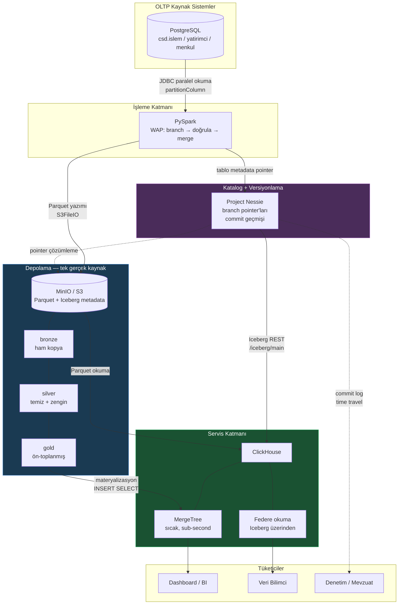

# CSD Data Lakehouse — Mimari Tasarım ve Veri Akışı

## 1. Problem tanımı

Bir menkul kıymet saklama kuruluşunda analitik iş yükü tipik olarak OLTP sistemleri (veya replikaları) üzerinden karşılanır. Bu yaklaşımın üç yapısal sınırı vardır:

| Sınır | Sonuç |
|---|---|
| Satır-bazlı depolama | Analitik tarama sorguları gereksiz sütunları da okur |
| OLTP ile kaynak paylaşımı | Ağır rapor, işlem sistemini yavaşlatır |
| Tarihsel derinlik yok | "31 Mart'ta ne vardı?" sorusu cevapsız kalır |

Lakehouse bu üçünü de hedefler: kolonsal depolama, işlem sisteminden fiziksel ayrışma, ve tarihin veri formatının kendisinde saklanması.

---

## 2. Bileşenlerin konumlanması

Mimarinin anlaşılmasındaki kritik nokta şu ayrımdır — **üç ayrı sorumluluk, üç ayrı bileşen**:

| Katman | Soru | Bileşen |
|---|---|---|
| Fiziksel depolama | Baytlar nerede? | **MinIO** (S3 API, Parquet dosyaları) |
| Tablo formatı | Bu baytlar nasıl bir tablo oluşturuyor? | **Apache Iceberg** (metadata, snapshot, şema) |
| Katalog | Şu anki tablo hangi metadata'yı gösteriyor? | **Project Nessie** (pointer + versiyon) |

Bu ayrımın pratik anlamı: MinIO'ya bakan biri sadece klasörler ve Parquet dosyaları görür — hangi dosyanın hangi tabloya, hangi versiyona ait olduğunu bilemez. O bilgi Iceberg metadata'sındadır. Iceberg metadata'sına bakan biri de tablonun **şu anki** halinin hangi metadata dosyası olduğunu bilemez — o da Nessie'dedir.

### Nessie tam olarak ne yapıyor?

Nessie'yi anlamanın en kısa yolu: **veri katalogunuzun Git'i**.

Klasik bir Iceberg katalogu (Hive Metastore, Glue) şunu tutar:

```
silver.islem  ->  s3://lakehouse/warehouse/silver/islem/metadata/00042-abc.metadata.json
```

Nessie ise bunu **branch başına** tutar:

```
main         ->  silver.islem  ->  ...00042-abc.metadata.json
                 gold.ozet     ->  ...00019-def.metadata.json

etl_20260717 ->  silver.islem  ->  ...00043-xyz.metadata.json   (yeni yazım)
                 gold.ozet     ->  ...00019-def.metadata.json   (aynı, değişmedi)
```

Buradan üç sonuç çıkar:

1. **Branch açmak 0 byte kopyalar.** Sadece yeni bir pointer kümesi oluşur. 2 milyar satırlık katalogda da milisaniye sürer.
2. **İzolasyon tablo değil katalog seviyesindedir.** Iceberg'in kendi branch'leri tek tablo kapsamındadır. 5 tabloyu tutarlı biçimde birlikte yayınlamak gerekiyorsa (mali tablo + işlem + pozisyon) Iceberg branch'i yetmez, Nessie yeter.
3. **Merge tek atomik commit'tir.** Okuyucu ya tüm değişikliği görür ya hiçbirini. "Yarım yüklenmiş rapor" durumu oluşmaz.

### Nessie'nin iki cephesi

Bu, kurulumun en sık gözden kaçan detayı:

```
                    ┌─────────────────────────┐
   Spark ──────────►│ :19120/api/v2           │  Nessie native API
                    │   (branch/merge/log)    │
                    ├─────────────────────────┤
   ClickHouse ─────►│ :19120/iceberg/<branch> │  Iceberg REST Catalog cephesi
                    │   (standart REST)       │
                    └─────────────────────────┘
```

Spark, Nessie'nin kendi API'sini konuşur — `CREATE BRANCH`, `MERGE BRANCH` gibi Git komutları buradan gider. ClickHouse ise Nessie'nin **Iceberg REST Catalog** uyumlu cephesinden bağlanır; onun için Nessie sıradan bir REST katalogudur ve branch, URL'deki path segment'idir.

> ### ⚠️ Bu kurulumda ClickHouse katalogdan okumuyor — ve bunun bir bedeli var
>
> Yukarıdaki şema **tasarlanan** mimaridir. Gerçekte ClickHouse 25.6 + Nessie 0.104.1
> çiftinde `DataLakeCatalog` veri okuyamıyor (katalog keşfi çalışıyor, `SELECT`
> patlıyor — ayrıntı: `sql/clickhouse/01_catalog.sql`). Bu yüzden `lake.*`
> görünümleri `icebergS3()` ile **doğrudan S3 yolunu** okuyor.
>
> `icebergS3()` **katalogu atlar**: Nessie'ye "main'in şu anki metadata'sı hangisi?"
> diye sormaz, tablo dizinindeki **en yeni** `metadata.json`'ı seçer. Nessie
> branch'leri aynı dizine yazdığı için "en yeni metadata" bir branch'in commit'i
> olabilir.
>
> **Ölçüldü** (`tests/06_clickhouse_branch_izolasyonu.py`):
>
> | | main | branch | ClickHouse ne gördü |
> |---|---|---|---|
> | Branch'e 1.000 satır yazıldı | 125.277 | 126.277 | **126.277** ❌ |
> | `DROP BRANCH` sonrası | 125.277 | — | **126.277** ❌ (metadata S3'te kalır) |
> | main'e yeni commit sonrası | 125.277 | — | 125.277 ✅ |
>
> **Sonuç:** WAP'ın "doğrulanmamış veri üretime ulaşmaz" garantisi *katalogdan
> okuyan* tüketiciler (Spark) için geçerli, bu kurulumda ClickHouse için **değil**.
> Başarılı ETL'de sorun kendini toplar (merge main'e yeni commit atar). **Asıl risk
> kalite kontrolü patladığında** — yani tam da WAP'ın koruması gereken anda.
>
> **Bu yüzden:** SLA'lı iş ve dashboard'lar `csd.*` (MergeTree) tablolarından
> beslenmeli; `lake.*` keşif içindir. `DataLakeCatalog`'un düzelmesi bu mimarideki
> **en değerli tek iyileştirmedir** — düzeldiğinde "iki motor aynı katalogu görür,
> tutarsızlık olmaz" cümlesi koşulsuz doğru olur.
>
> **Ölçülmüş güncel durum (25.6 → 26.6 test edildi):** Bu, sanıldığından daha
> yakın. `DataLakeCatalog` **keşfi bu ortamda çalışıyor** — yalnızca doğru base
> URL ile (`/iceberg`, `/iceberg/main` değil; ref bir *prefix*'tir, config'den
> keşfedilir). Önceki "keşif bile şüpheli" izlenimi yanlış bir URL'den
> kaynaklanıyordu. Okuma (`SELECT`) tarafındaki yol-birleşme hatası ise
> ClickHouse'ta **aktif olarak düzeliyor**: 25.6 `s3://` önekini bırakıyor,
> 25.8 öneki soyuyor ama hâlâ birleştiriyor, **26.6'da yol birleşmesi tamamen
> gitmiş** (kalan tek engel S3 okuma kimlik/çözümleme bağlaması). Yani "gelecekte
> düzelir" değil, "26.x'te yolu düzelmiş, tam çalışır hale gelince doğrulayıp
> geçin" — ayrıntılı ölçüm: `sql/clickhouse/01_catalog.sql` başlığı.
>
> Not: `iceberg_snapshot_id` ayarı **sorgu seviyesinde** çalışıyor (ölçüldü:
> sabitsiz 126.277, sabitli 125.277) ama **görünüm içinde çalışmıyor** —
> ClickHouse ayarı saklıyor, `SHOW CREATE VIEW` gösteriyor, fakat görünüm
> genişletilirken uygulamıyor. Bu yüzden "sabitlenmiş görünüm" seçeneği
> bilerek eklenmedi: çalışmayan ama çalışıyor *görünen* bir güvenlik anahtarı,
> hiç olmamasından tehlikelidir.

---

## 3. Uçtan uca veri akışı



### Adım adım

**1. OLTP → Bronze** (`jobs/01_oltp_to_bronze.py`)

Spark, Postgres'ten JDBC ile **paralel** okur. Buradaki kritik ayar `partitionColumn` / `lowerBound` / `upperBound` / `numPartitions` dörtlüsüdür — verilmezse Spark tüm tabloyu tek bağlantıdan, tek executor ile çeker. Bu hem yavaştır hem de kaynak OLTP'de tek uzun sorgu oluşturur. Üretim OLTP'sine dokunurken pazarlık konusu olan şey tam olarak budur.

Yazım **doğrudan main'e değil**, izole bir Nessie branch'ine yapılır (Write-Audit-Publish).

**2. Bronze → Silver** (`jobs/02_bronze_to_silver.py`)

Boyut birleştirme, tekrar ayıklama, türetilmiş alanlar. Geçersiz satırlar **düşürülmez, karantinaya alınır** — sebebiyle birlikte. Düzenlemeye tabi bir kurumda "kaynakta 20.000.000 vardı, silver'da 19.999.987 var, 13'ü nerede?" sorusunun cevabı olmalıdır.

**3. Silver → Gold** (`jobs/03_silver_to_gold.py`)

İş sorusuna göre ön-toplama. 20M satır → 939k satırlık özet; tipik bir çeyreklik rapor sorgusu bunun yalnızca 115k satırına dokunuyor. **Sub-second hedefine giden yolun büyük kısmı burada kazanılır**; ClickHouse'un hızlı olması ikinci adımdır. Yanlış modellenmiş veriyi hızlı motor kurtarmaz.

> **Tanım farkları burada ortaya çıkar.** `gold.yatirimci_pozisyon`, kaynak
> sistemin `csd.bakiye` tablosuyla mutabık olmalıdır. 2M satırda ikisi birebir
> tutuyordu; 20M'de **2 satır** fark çıktı — çünkü kaynak sistem net pozisyonu
> sıfır olan (kapanmış) pozisyonları `HAVING ... <> 0` ile dışlıyor, gold ise
> dışlamıyordu. 2M'de hiçbir çift tam sıfıra kapanmadığı için fark görünmüyordu.
> Ders: **iki kaynağın aynı sayıyı vermesi, aynı tanımı kullandıkları anlamına
> gelmez.** Küçük veride örtüşen tanım farkları büyük veride ayrışır.
> (Düzeltildi; `tests/05_mutabakat.sql` artık 10.384.619 pozisyonda 0 fark veriyor.)

**4. Gold → ClickHouse** (`sql/clickhouse/03_materialize_mergetree.sql`)

Sıcak veri ClickHouse'un kendi formatına (MergeTree) alınır.

---

## 4. ClickHouse'un iki modu — mimarinin en önemli kararı

Bu bölüm yöneticilere anlatılırken **açıkça** söylenmelidir, çünkü yanlış beklenti kurulursa demo günü ters teper.

### ÖLÇÜLEN RAKAMLAR (tahmin değil)

**20.000.000 satır**, lokal Docker, MinIO aynı makinede. Kaynak: `system.query_log`.

| Katman | Süre | Okunan satır | Okunan veri |
|---|---|---|---|
| 1. PostgreSQL (bugünkü yol) | **15.414 ms** | 2,45 M | 114 MiB |
| 2. ClickHouse → Iceberg (federe) | 198 ms | 1,38 M | 45 MiB |
| 3. ClickHouse → MergeTree (detay) | 83 ms | 2,37 M | 47 MiB |
| 4. ClickHouse → **Gold özet** | **10 ms** | 115 k | 3 MiB |

### ÖLÇEK TESTİ: makas gerçekten açılıyor mu?

Bu dokümanın önceki sürümünde *"gerçek hacimde makas açılır"* diye **ölçülmemiş bir beklenti** yazılıydı. Ölçtük. Aynı sorgu, aynı makine, veri hacmi 10 kat:

| | 2M satır | 20M satır | 10x veri ile |
|---|---|---|---|
| PostgreSQL | 1.034 ms | **15.414 ms** | **14,9x kötüleşti** |
| Gold özet | 8 ms | **10 ms** | 1,25x — neredeyse **sabit** |
| **Hızlanma** | 129x | **1.541x** | — |

**Beklenti doğrulandı ve gerçek rakam tahminden büyük çıktı.** PostgreSQL superlineer kötüleşiyor; gold katmanı pratikte sabit kalıyor, çünkü özet tablo 24k→939k büyürken sorgunun *okuduğu* satır 115k'da kalıyor (partition pruning + sparse index). Mimarinin en güçlü tek argümanı budur.

### Bu rakamlar ne söylüyor?

**1. Bu ölçekte bile federe Iceberg okuması ZATEN sub-second.** 198 ms. Materyalizasyon "sub-second'a çıkmak için" değil, "eşzamanlılık altında taahhüt verebilmek için" yapılıyor. Bunu doğru kurmak önemli: yöneticiye "ClickHouse olmadan sorgu saniyeler sürer" derseniz ve biri `lake.silver_islem`'e sorgu atıp 198 ms alırsa, güvenilirliğiniz gider.

**2. Iceberg'in zayıflığı NOKTA ATIŞINDA ve sebebi öğretici.** Iceberg, partition sütunu olmayan bir alanda filtre verildiğinde **tüm tabloyu tarar**. Iceberg'de Parquet row-group min/max istatistikleri vardır ama ClickHouse'un sparse primary index'i ve bloom filter'ı **yoktur**. MergeTree, `bloom_filter` skipping index'i sayesinde granule'lerin büyük kısmını hiç açmaz.

**3. Partition pruning Iceberg'de de çalışıyor.** Dar zaman aralığında tablonun tamamı yerine küçük bir kesit okunuyor. Yani Iceberg'in zayıflığı "yavaşlık" değil, **indeks yokluğu**dur — doğru filtre verildiğinde hızlıdır.

### EŞZAMANLI YÜK — asıl mimari kanıt (ölçüldü)

Yukarıdakiler **tek kullanıcı** rakamları ve o yüzden yanıltıcı. Dashboard'a 50 kişi aynı anda girdiğinde (`.\run.ps1 bench`), 20M satırda:

| | Iceberg (federe) | MergeTree (gold) | Fark |
|---|---|---|---|
| **QPS** | 49 | **211** | 4,3x |
| P50 | 918 ms | 160 ms | 5,7x |
| P90 | 1.263 ms | 289 ms | 4,4x |
| P95 | 1.374 ms | 343 ms | 4,0x |
| **P99** | **1.559 ms** | **426 ms** | 3,7x |
| P99.9 | 1.842 ms | 469 ms | 3,9x |

**Bu tablo materyalizasyonun gerekçesidir.** Tek sorguda Iceberg 198 ms'ydi ve "materyalizasyon gereksiz mi?" sorusu haklıydı. 50 eşzamanlı kullanıcıda **Iceberg'in P99'u 1.559 ms'ye çıkıyor — saniyeyi kırıyor**; MergeTree 426 ms'de kalıyor ve aynı sürede 4,3 kat fazla sorgu işliyor.

Eşzamanlılıkta da ölçekle makas açılıyor: 2M'de P99 farkı 2,8x idi, 20M'de **3,7x**.

Sebep: her federe sorgu Iceberg metadata zincirini baştan çözer ve Parquet'leri HTTP üzerinden çeker — 50 kullanıcı = 50 kat metadata işi + 50 kat S3 isteği. MergeTree'de sparse index ve mark cache **paylaşılır**; ikinci kullanıcı birincinin ısıttığı cache'ten faydalanır.

> **Sunumda ortalama değil P99 konuşun.** "Ortalama 130 ms" bir taahhüt değildir; *"50 eşzamanlı kullanıcıda sorguların %99'u 310 ms altında"* taahhüttür. Yöneticiler SLA diliyle düşünür.

### Fark daha da nerede büyür? (bunlar ölçülmedi — beklenti)

- **Ağ gecikmesi:** MinIO burada aynı makinede. Uzak object storage'da her `metadata.json → manifest list → manifest → data file` adımı ağ turu demektir.
- **Metadata şişmesi:** Bakımsız bir tabloda binlerce manifest → sorgu *planlama* süresi veri okumadan önce saniyelere çıkar (bkz. bölüm 6).

**Veri hacmi artık beklenti değil, ölçüm:** 2M→20M geçişi yukarıda ölçüldü ve makas 129x'ten 1.541x'e açıldı. Kalan iki maddeyi **beklenti** olarak sunun — ölçtüklerinizle karıştırmak, ölçtüklerinizin de değerini düşürür.

### Doğru çerçeve

**Asıl headline `1.541x`:** bugünkü PostgreSQL yolu 15.414 ms, gold katmanı 10 ms. Lakehouse'un getirisi burada — ve bu oran veri büyüdükçe *artıyor*.

| Mod | Ne zaman |
|---|---|
| **Federe** (`lake.silver_islem`) | Keşif, ad-hoc, henüz modellenmemiş veri, soğuk veri. Kopyalamadan sorgula. |
| **Materyalize** (`csd.gunluk_menkul_ozet`) | Dashboard, SLA'lı iş, yüksek eşzamanlılık, nokta atışı erişim. |

Bu ikisi **alternatif değil, tamamlayıcıdır**:

```
Iceberg/MinIO  = tek gerçek kaynak. Ucuz, sınırsız, versiyonlu, otorite.
ClickHouse MT  = türetilmiş okuma kopyası. Pahalı, sınırlı, çok hızlı, silinebilir.
```

ClickHouse'taki veri **otorite değildir**. Diski patlasa, container silinse veri kaybı **yoktur** — tek yapılacak materyalizasyon scriptini tekrar çalıştırmaktır. Dayanıklılık argümanı budur.

Yöneticiye söylenecek cümle:

> "Bütün veri göllerde duruyor ve her an sorgulanabilir. Dashboard'a giren %2'lik sıcak kesiti ClickHouse'a materyalize ediyoruz ve orası milisaniye seviyesinde. İkisi aynı katalogdan besleniyor, dolayısıyla tutarsızlık riski yok."

### Tazelik nasıl sağlanır?

`REFRESH EVERY 1 HOUR` ile ClickHouse Iceberg'i periyodik yeniden okur ve tabloyu **atomik** değiştirir. Yenileme sırasında okuyucular eski tabloyu görür — yarım veri görmezler. Alternatif: Airflow'dan zamanlanmış `INSERT INTO ... SELECT`.

---

## 5. Neden merge-on-read değil copy-on-write?

Iceberg v2 varsayılanı **merge-on-read**'dir: silme/güncelleme işlemleri ayrı "delete file"lar yazar, okuyucu bunları runtime'da birleştirir. Yazım hızlıdır.

**Ancak** ClickHouse'un Iceberg okuyucusunun positional/equality delete desteği sürüm sürüm değişkendir. ClickHouse'un okuyacağı tablolarda bu, sessiz yanlış sonuç riski demektir — en kötü hata türü.

Bu yüzden ClickHouse'un gördüğü tüm tablolarda:

```sql
'write.delete.mode' = 'copy-on-write',
'write.update.mode' = 'copy-on-write',
'write.merge.mode'  = 'copy-on-write'
```

Yazım biraz pahalı, okuma **her motorda doğru**. Yalnızca Spark'ın okuduğu tablolarda MOR bırakılabilir.

---

## 6. Bakım — projelerin 6. ayda çöktüğü yer

Iceberg her yazımda yeni dosya + yeni manifest + yeni snapshot üretir. Bakımsız bir tabloda:

| Sorun | Sonuç |
|---|---|
| Küçük dosya patlaması | Her sorgu binlerce S3 GET yapar |
| Manifest şişmesi | Sorgu **planlama** süresi saniyelere çıkar |
| Snapshot birikimi | Silinen veri diskten hiç gitmez |
| Yetim dosyalar | Başarısız job artıkları birikir |

`jobs/99_maintenance.py` dördünü de ele alır. Önerilen takvim:

| Sıklık | İşlem | Araç |
|---|---|---|
| Günlük | `rewrite_data_files` (sıcak partition'lar) | Iceberg prosedürü |
| Haftalık | `rewrite_manifests` | Iceberg prosedürü |
| Haftalık | Snapshot/dosya temizliği | **Nessie GC** (`.\run.ps1 gc 168`) |

> ### Dikkat: Nessie ile `expire_snapshots` ÇALIŞMAZ — ve çalışmaması doğrudur
>
> Klasik Iceberg alışkanlığı burada yanlışa götürür. Nessie tüm tablolara
> `gc.enabled=false` koyar; `expire_snapshots` ve `remove_orphan_files`
> denendiğinde şu hatayı verir:
>
> ```
> ValidationException: Cannot expire snapshots: GC is disabled
> (deleting files may corrupt other tables)
> ```
>
> **Sebep:** Nessie'de aynı veri dosyaları birden fazla branch/tag tarafından
> referans edilebilir. Iceberg'in `expire_snapshots`'ı yalnızca *tek bir
> tablonun* kendi snapshot zincirine bakar; başka branch'lerden haberi yoktur.
> Çalıştırılsaydı, main'de "artık kullanılmıyor" sanıp sildiği dosya başka bir
> branch'in tek veri kaynağı olabilirdi → **sessiz veri kaybı**. Bu bir engel
> değil, güvenlik kilididir; `gc.enabled=true` yazıp zorlamayın.
>
> **Doğru araç Nessie GC'dir:** tüm commit grafiğini (bütün branch ve tag'leri)
> birlikte değerlendirir. Ayrı bir jar'dır, sunucu imajında yoktur.
> Bu ortamda çalıştırıldı ve doğrulandı: `EXPIRY_SUCCESS`, 15 yetim dosya
> silindi, hiçbir tablo bozulmadı. Ayrıntı: `jobs/99_maintenance.py` [4/4] notu.
>
> **Saklama süresi = time travel pencereniz.** Nessie GC'nin `--default-cutoff`
> değeri CSD'nın tabi olduğu saklama mevzuatıyla uyumlu seçilmelidir; süresi
> dolan snapshot'a geri dönülemez. Repodaki 7 gün (`PT168H`) yalnızca demo içindir.

---

## 7. Sürüm uyumluluğu

Bu dörtlü birbirine bağımlıdır; `.env` içinden tek yerden yönetilir:

| Bileşen | Sürüm | Not |
|---|---|---|
| Spark | 3.5.3 | Iceberg'in en olgun desteklediği hat |
| Iceberg | 1.9.1 | `iceberg-spark-runtime-3.5_2.12` |
| Nessie | 0.104.1 | `nessie-spark-extensions-3.5_2.12` aynı sürüm olmalı |
| ClickHouse | 25.6 | `DataLakeCatalog` için ≥ 25.3 gerekir |

> Bu sürüm numaralarını **doğrulayın**. Ekosistem hızlı hareket ediyor; imaj tag'leri veya Maven koordinatları değişmiş olabilir. `docker compose build` aşamasında 404 alırsanız ilgili artifact'in güncel sürümüne bakıp `.env` içinde güncelleyin — dosyaların geri kalanı değişmez.

---

## 8. Üretime giderken — bu repoda **olmayan** ve gereken şeyler

Bu bir lokal referans kurulumudur. CSD üretimi için eksikler, dürüstçe:

| Konu | Bu repoda | Üretimde gereken |
|---|---|---|
| Nessie version store | JDBC → **tek node** PostgreSQL (OLTP ile *aynı* instance) | JDBC → HA/replikalı PostgreSQL, OLTP'den **ayrı** instance |
| Kimlik doğrulama | Yok (`authentication.type=NONE`) | OIDC/Keycloak; Nessie ve MinIO'da |
| Yetkilendirme | Yok | Nessie authz kuralları + MinIO IAM policy; sütun/satır seviyesi maskeleme |
| Sırlar | `.env` düz metin | Vault / K8s Secrets. **`.env` asla commit edilmemeli** |
| Şifreleme | Yok | TLS her uçta; MinIO SSE-KMS at-rest |
| Orkestrasyon | **Airflow referans DAG'i var** (`--profile orchestration`): bağımlılık + retry + mutabakat kapısı. Ama tek node, `standalone`, docker soketi üzerinden iş gönderiyor | Ayrı scheduler/webserver; `KubernetesPodOperator` veya Spark on K8s (soket paylaşmadan); SLA + alarm entegrasyonu |
| Kaynak yakalama | JDBC batch | Debezium CDC → Kafka → Spark Structured Streaming |
| Yüksek erişilebilirlik | Tek node her şey | MinIO distributed (EC), ClickHouse replikalı, Nessie çok replika |
| İzleme | Yok | Prometheus + Grafana; Spark history server |
| Veri kalitesi | Elle yazılmış kontroller | Great Expectations / Soda; kural kataloğu |
| Yedekleme | MinIO versioning | Cross-region replication; Nessie export |
| **ClickHouse ↔ katalog** | `icebergS3()` — katalogu **atlar**, branch izolasyonu yok | Çalışan `DataLakeCatalog` (REST). Bu düzelene kadar SLA'lı iş MergeTree'den beslenmeli |

**Bu tablo bir zayıflık değil, olgunluk göstergesidir.** Yöneticiye "her şey hazır" demek yerine "çekirdek mimari kanıtlandı, üretim için şu 12 kalem var ve şu sırayla ele alınmalı" demek, stajyer sunumu ile mühendis sunumu arasındaki farktır.

---

## 9. Neden bu bileşenler? — alternatifler ve gerekçe

| Karar | Alternatif | Neden bu |
|---|---|---|
| Iceberg | Delta Lake, Hudi | Motor bağımsızlığı en yüksek olan format. Delta pratikte Databricks ağırlıklı; Iceberg'i Spark, Trino, ClickHouse, Flink, DuckDB hepsi okur. Vendor lock-in riski en düşük seçenek. |
| Nessie | Hive Metastore, AWS Glue, Polaris | Git semantiği veren tek olgun seçenek. Metastore sadece pointer tutar; branch/merge/commit yok. Polaris (Snowflake) daha yeni ve versiyonlama Nessie kadar merkezi değil. |
| MinIO | HDFS, doğrudan bulut S3 | S3 API uyumlu, on-prem çalışır (CSD için önemli), buluta geçilirse kod değişmez — sadece endpoint değişir. |
| ClickHouse | Trino, DuckDB, Druid | Sub-second + yüksek eşzamanlılık kombinasyonunda en güçlüsü. Trino federasyonda iyi ama sub-second dashboard için tasarlanmadı. |
| PySpark | Flink, dbt | Batch ETL + Iceberg yazımında en olgun. Iceberg'in referans entegrasyonu Spark üzerinde geliştirilir. |

---

## 10. Bu mimarinin çözmediği şeyler

Dürüstlük gereği:

- **Gerçek zamanlı değildir.** Batch ETL + saatlik materyalizasyon. Milisaniyelik gecikme gerekiyorsa Kafka + Flink gerekir.
- **Küçük veride aşırı mühendisliktir.** 50 GB'lık bir problem için tek bir PostgreSQL + doğru indeks yeter. Bu mimari yüzlerce GB / TB ölçeğinde anlam kazanır.
- **Operasyonel yük getirir.** 5 bileşen = 5 ayrı hata kaynağı. Bakım yapılmazsa 6 ayda bozulur (bkz. bölüm 6).
- **Nessie ekosistemi görece küçüktür.** Iceberg ve ClickHouse geniş topluluklara sahip; Nessie daha dar. Sorun yaşandığında Stack Overflow'da cevap bulma olasılığı daha düşük.
